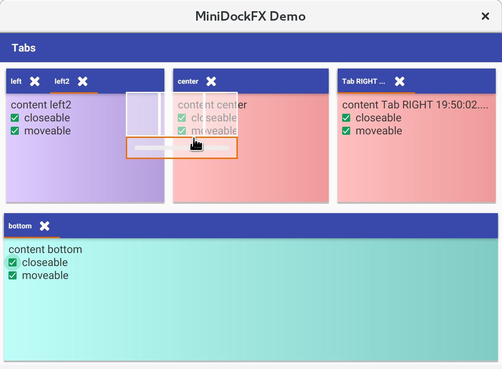

# MiniDockFx

This package provides (yet another) simple docking component for JavaFX.
Most alternatives in 2020 did either not run on all operating systems or were way too complex. 

This docking component provides the following capabilities:

* has a fixed layout with 4 docking areas (left, center,right, bottom)
* each docking area is a JFXTabbedPane
* users could move the tabs by dragging them onto a small screen element showing possible docking areas
* users could close the tabs using the button
* users could close the tabs using a context menu with the entries
    * Close
    * Close All
    * Close All to Left/Right
* users could maximise / unmaximise a dock using the context menu or double click 
* split positions are stored in java.util.Preferences  

The implementation is pretty simple, it is just four classes and two fxml files.
Styling is possible using CSS, there are no hardcoded values.

## Usage

1. Derive a view from AbstractTabableView. Here you could provided
   * the view name displayed in the tab
   * change whether your views supports moving or closing by a user
   * the Node you want to display
2. Instantiate a MiniDockFXPane
3. Add the views to the dock pane
4. Add the styling to your CSS. An example CSS file is found in src/test/resources/de/cadoculus/javafx/minidockfx/minidockfx.css

See [Main.java](src/test/java/de/cadoculus/javafx/minidockfx/demo/Main.java) as example how to use the docking area,
[ExampleTabview1](src/test/java/de/cadoculus/javafx/minidockfx/demo/ExampleTabview1.java) as example how to implement a view.

## Dependencies
* javafx
* jfoenix
* ikonli with fontawesome pack
* slf4j

## I18N
The context Menu has some I18N support, the resource bundle contains a default bundle in English ( still british :-), 
French and German.

## Maven Central 

The sources, javadoc and jars are available on Maven Central:
[Maven Central](https://oss.sonatype.org/#nexus-search;quick~minidockfx)
## License

This code is under a  [BSD License](LICENSE), so feel free to use it without too many obligations :-)
    